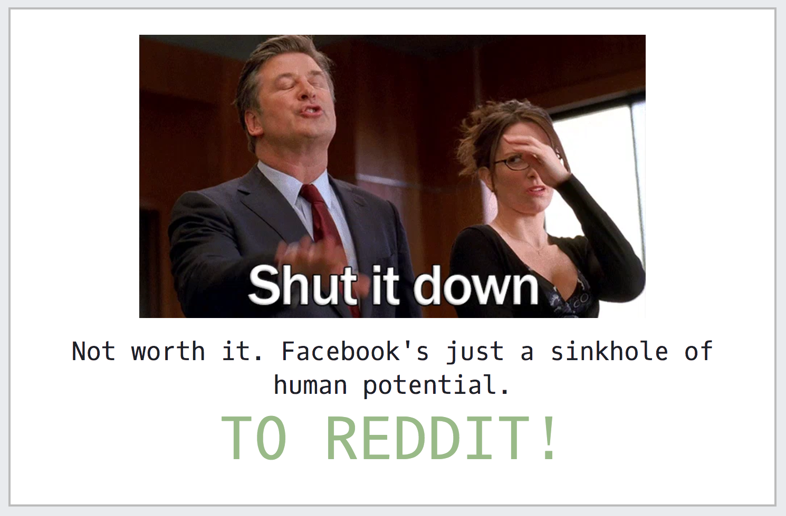

# javascript-nuke-facebook

## Shut it down!

Facebook sucks up so much time. I haven't been on in years and only use messenger. I recently logged in because I needed RSVP to a relative's wedding, and noticed how easy it is to get sucked back in. I prefer to stay away from facebook, this userscript does just that. If you're using Firefox, use [Greasemonkey](https://addons.mozilla.org/en-US/firefox/addon/greasemonkey/). If you're using Chrome, use [Tampermonkey](https://chrome.google.com/webstore/detail/tampermonkey/dhdgffkkebhmkfjojejmpbldmpobfkfo?hl=en). If you're using a different browser, you're in luck. As long as your browser supports userscripts, you can use this. It's just a javascript file so, inject away.

