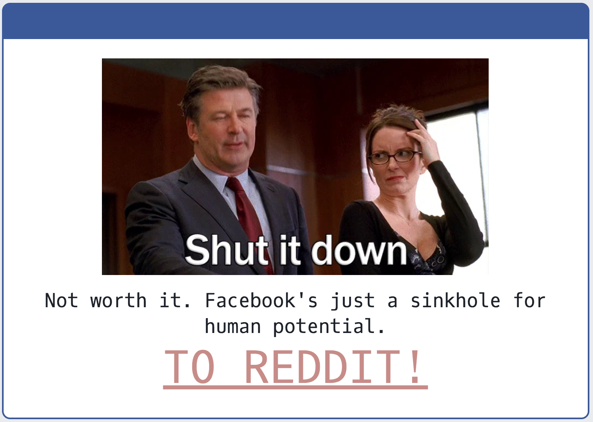

# javascript-nuke-facebook

## Shut it down!

Facebook sucks up so much time. I haven't been on in years and only use messenger. I recently logged in because I needed RSVP to a relative's wedding, and noticed how easy it is to get sucked back in. I prefer to stay away from facebook, this userscript does just that.

## "Installing"
Your browser needs to be capable of running UserScripts (pretty much all modern browsers). Google your browser and "userscript extension" or you can just [look here](https://greasyfork.org/en).

You can go to either:
 - [Directly from GitHub](https://github.com/paul-nelson-baker/javascript-nuke-facebook/raw/master/shut-it-down.user.js) (recommended, always up to date)
 - [OpenUserJS](https://openuserjs.org/scripts/paulbaker/Shut_it_down!)
 - [GreasyFork](https://greasyfork.org/en/scripts/31907-shut-it-down)

## Building
`npm run build`
`npm run build:prod`

